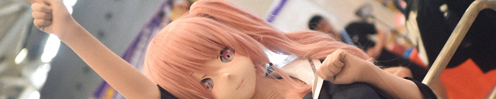

## Hi there 👋

  

    
    
    
    
    

    
    
    
    

    

graduate from South China Univ of Tech, worked as research assistant in HKU, now study at PolyU  
Kigurumi lover! anime fun! Night owl!
- 🔭 I’m currently working on text 2 sql and explainable AI
- 🌱 I’m currently learning CNN
- 👯 I’m looking to collaborate on researchers who have interest in CV, CG, GNN and LLM
- 💬 Please feel free to ask me about CG, .Net framework and so on
- 📫 How to reach me: ziq93812@gmail.com
- 😄 Pronouns: I don`t care

